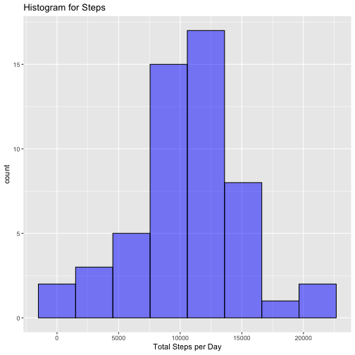
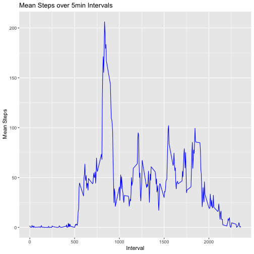
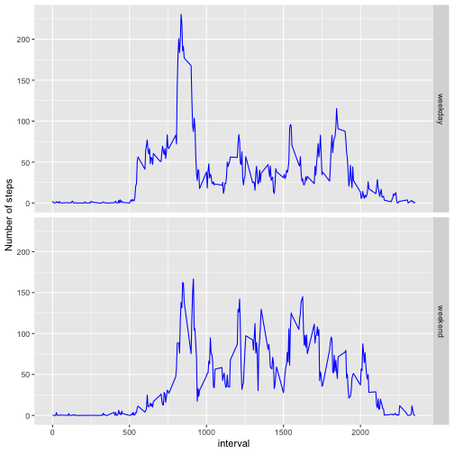

##Loading and preprocessing the data


```r
activity <- read.csv("activity.csv")
```

##What is mean total number of steps taken per day?

First, we want to summarize the date using the following r code:

```r
library(dplyr)
```

```
## Warning: package 'dplyr' was built under R version 3.5.1
```

```
## 
## Attaching package: 'dplyr'
```

```
## The following objects are masked from 'package:stats':
## 
##     filter, lag
```

```
## The following objects are masked from 'package:base':
## 
##     intersect, setdiff, setequal, union
```

```r
group_activity <- group_by(activity, date)
steps <- summarize(group_activity, totalsteps = sum(steps))
```

Then, we made a histogram of the total number of steps taken each day.

```r
library(ggplot2)
qplot(steps$totalsteps, 
      geom="histogram",
      bins=8,
      main = "Histogram for Steps",
      xlab = "Total Steps per Day",
      ylab = "count",
      fill = I("blue"),
      color = I("black"),
      alpha = I(.5)
      )
```

```
## Warning: Removed 8 rows containing non-finite values (stat_bin).
```



Finally, we can calculate the mean and median total number of steps taken per day by the following r code:

```r
meansteps <- mean(steps$totalsteps, na.rm = TRUE)
mediansteps <- median(steps$totalsteps, na.rm = TRUE)
```

The mean total number of steps taken per day is 1.0766189 &times; 10<sup>4</sup>;
The median total number of steps taken per day is 10765.

##What is the average daily activity pattern?

First, we summarized the mean steps in each 5-min interval over all days.

```r
group_activity2 <- group_by(activity, interval)
intervals <- summarize(group_activity2, msteps = mean(steps, na.rm=TRUE))
```

Then, a time series plot representing the mean steps was plotted.

```r
qplot(intervals$interval, intervals$msteps,
      geom="line",
      main = "Mean Steps over 5min Intervals",
      xlab = "Interval",
      ylab = " Mean Steps",
      color = I("blue")
      )
```



Further, the interval that contains the maximum value of mean steps can be found using the following r code:

```r
sortintervals <- arrange(intervals, desc(msteps))
maxinterval <- sortintervals[1,1]
```

and this interval is 835.

##Imputing missing values

First, here is the r code to calculate the total number of missing values in the dataset.

```r
missing <- sum(is.na(activity$steps))
```
There are 2304 missing values(NA) in the dataset.

We chose to use the mean steps in the correspondent interval to replace the NA value.

Here is the r code to make the new dataset:


```r
nadata <- filter(activity, is.na(steps)==TRUE)
nonmissing <- filter(activity, is.na(steps)==FALSE)
joint <- merge(nadata, intervals, by="interval")
replacena <- joint %>% mutate(steps=msteps) %>% select(-msteps)
activityfilled <- rbind(replacena, nonmissing)
```

Now we make the histogram of the total number of steps each day and calculate the mean and median total number steps taken per day based on the new dataset.


```r
group_activityfilled <- group_by(activityfilled, date)
steps2 <- summarize(group_activityfilled, totalsteps = sum(steps))
meansteps2 <- mean(steps2$totalsteps, na.rm = TRUE)
mediansteps2 <- median(steps2$totalsteps, na.rm = TRUE)
```

```r
qplot(steps$totalsteps, 
      geom="histogram",
      bins=8,
      main = "Histogram for Steps",
      xlab = "Total Steps per Day",
      ylab = "count",
      fill = I("blue"),
      color = I("black"),
      alpha = I(.5)
      )
```

```
## Warning: Removed 8 rows containing non-finite values (stat_bin).
```


The mean and median total number steps taken per day are 1.0766189 &times; 10<sup>4</sup> and 1.0766189 &times; 10<sup>4</sup>, respectively. After imputing NA by mean steps value of correspondent interval, there is no change for overall mean steps, but the median value changed.

##Are there differences in activity patterns between weekdays and weekends?

To answer this question, we first created a new column "weekday" in the new dataset using the following code:


```r
library(lubridate)
```

```
## 
## Attaching package: 'lubridate'
```

```
## The following object is masked from 'package:base':
## 
##     date
```

```r
activitydate <- mutate(activityfilled, date=ymd(date))
activitydate <- mutate(activitydate, weekday=weekdays(date))
weekdays <- filter(activitydate, weekday %in% c("Monday", "Tuesday", "Wednesday", "Thursday", "Friday"))
weekends <- filter(activitydate, weekday %in% c("Saturday", "Sunday"))
weekdays <-mutate(weekdays, weekday="weekday")
weekends <- mutate(weekends, weekday="weekend")
alldays <- rbind(weekends, weekdays)
alldays2 <- alldays %>% group_by(weekday, interval) %>% 
            summarise(msteps=mean(steps))
```

Then, a time series plot of mean steps of each interval is made for weekends and weekdays, respectively.


```r
g <- ggplot(alldays2, aes(x=interval, y=msteps))
g + geom_line(color="blue") + labs(y = "Number of steps") + facet_grid(weekday~.)
```



It seems there are indeed different patterns of mean steps between weekdays and weekends.
